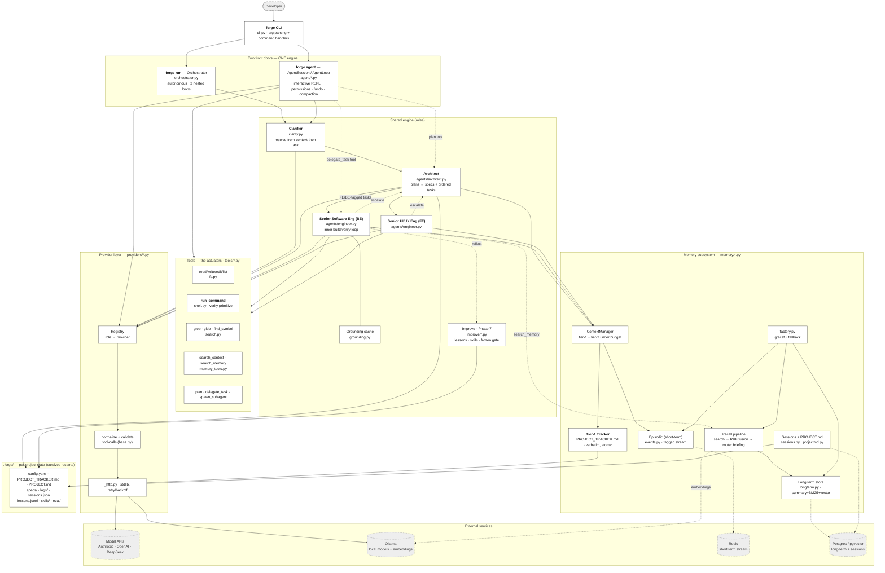

# Diagram · System Component Overview

The "complete system" picture at component: the two front
doors, the shared engine they shouldn't be confused for separate copies of, the
actuator layers (tools + providers), the three-tier memory subsystem, the on-disk
state, and the external services Forge talks to.

> Renders natively on GitHub and in any Mermaid-aware viewer. Source is editable
> text so it stays in sync with the code.

## Legend

- **Solid arrow** — direct call / data flow.
- **Dashed arrow** — optional, best-effort, or tool-mediated (e.g. `escalate`, the
  agent's capability tools, memory writes that degrade gracefully).
- **Cylinders / grey dashed boxes** — external services and on-disk state, i.e. the
  things outside the Python process.

## The three things this diagram is meant to show

1. **One engine, two doors.** `forge run` and `forge agent` both point into the *same*
   clarifier / architect / engineers / memory — the agent reaches them through its
   `plan` and `delegate_task` tools rather than owning copies.
2. **Verification is structural.** `run_command` (the verify primitive) sits in the
   tool layer and is what the inner loop runs to decide "done" — the model never
   self-certifies.
3. **Graceful degradation.** Every external service hangs off a dashed edge; if Redis
   / Postgres / Ollama-embeddings are down, memory falls back to in-memory and the
   on-disk tracker remains the durability backstop.
