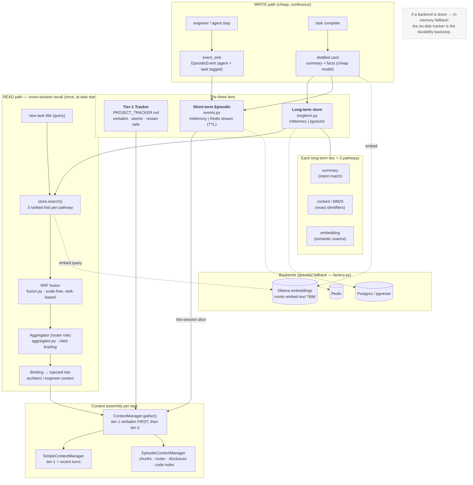

# Diagram · Memory Architecture

The three memory tiers and the cross-session recall pipeline: how a turn's events
are written cheaply to short-term, distilled into long-term at task completion, and
recalled into a future session via search → RRF fusion → router briefing.

## Reading it

- **Write often & cheap**: every durable step appends a tagged `EpisodicEvent` to
  short-term; only at task completion is a *distilled card* (not the raw transcript)
  promoted to long-term.
- **Read rarely & up-front**: cross-session recall runs **once** at task start. The
  three independent ranked lists are fused by **rank** (RRF — scores are
  incomparable), then the `router` model synthesizes a short **cited** briefing.
- **Tier-1 is always first and verbatim**; tier-2 (recall briefing + this-session
  slice + episodic/code retrieval) is layered under it within the token budget.
- **Degradation**: Redis/Postgres/Ollama all sit on dashed edges; losing them drops
  to in-memory equivalents, never blocking the run.
