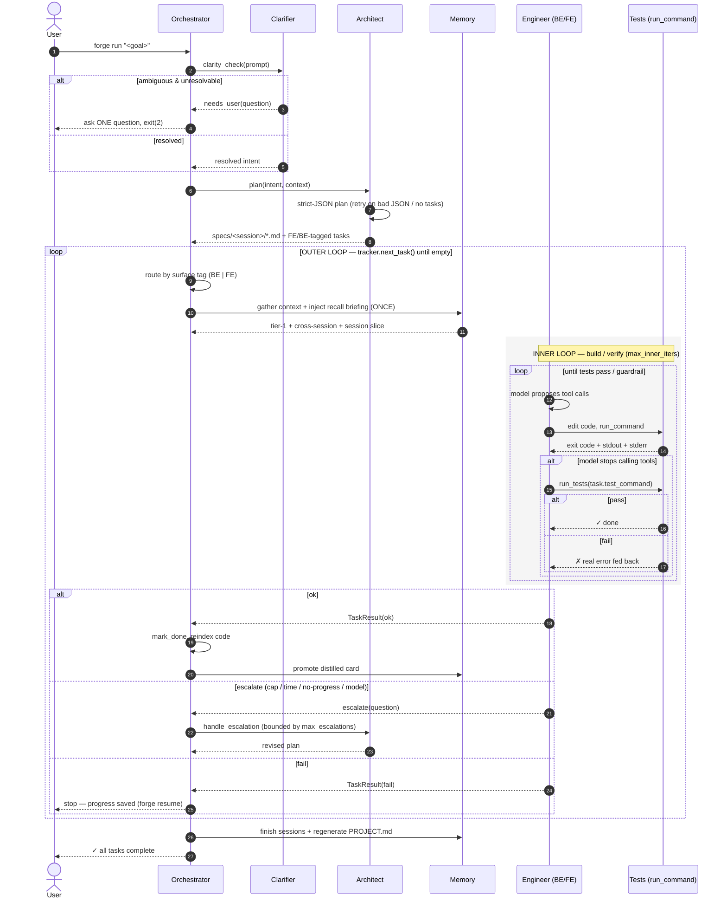

# Diagram · Autonomous Run Sequence (`forge run`)

The clarifier → architect → engineer pipeline over time, including the outer
plan/progress loop, the inner build/verify loop, escalation, and memory injection.

## Reading it

- **The test is the only success exit** — the engineer signals "done" by stopping
  tool calls, and the orchestrator then runs the test directly (it never trusts the
  model's self-assessment).
- **Failures escalate, they don't crash** — iteration cap, wall-clock budget, and
  no-progress detection all hand the task back to the architect (bounded by
  `max_escalations`) rather than looping forever.
- **Memory is injected once** per task and a distilled card is promoted on success.
- **Restart-safe** — a `fail` stops the run but the tracker on disk is up to date, so
  `forge resume` continues from the next unfinished task.
