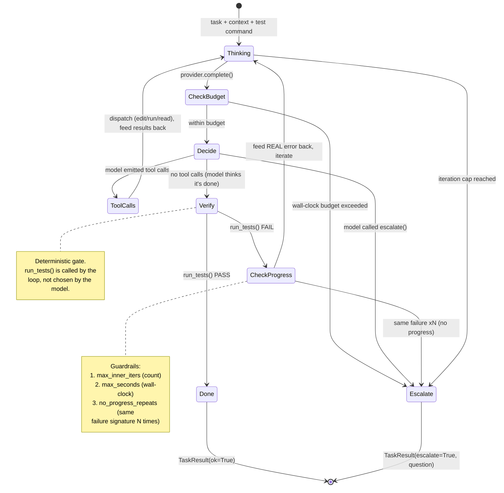

# Diagram · Inner Build/Verify Loop (state machine)

The engineer's per-task loop — the heart of Forge's loop-engineering thesis. The
model never decides it is done; a deterministic test run is the only success exit,
and three guardrails guarantee the loop can never flail forever.

## Reading it

- **`Verify` is the only path to `Done`** — and it runs the test command directly, so
  a confident-but-wrong model is caught and the *actual* error text is fed back into
  the next `Thinking` step.
- **Every exit is bounded** — the three guardrails all route to `Escalate`, which
  hands the task back to the architect with a concrete question instead of failing
  silently or spinning.
- **`escalate()` is a pseudo-tool** — advertised to the model but intercepted by the
  loop, so "I'm blocked, replan" travels through the normal tool-calling channel
  without a real side effect.
